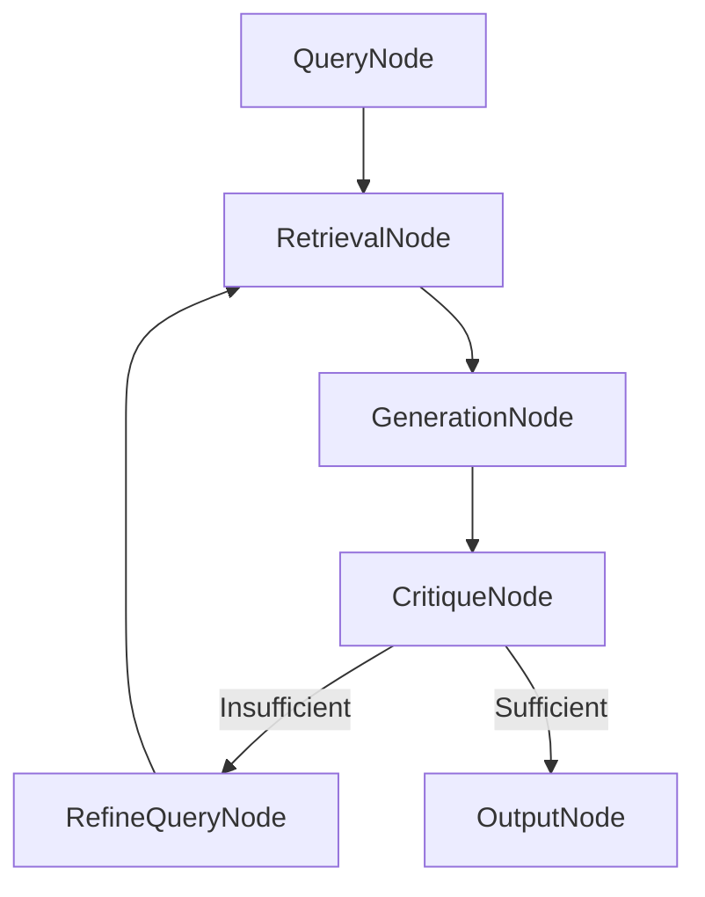

# myCLAUDE.md

## Project Overview
This project implements a **Scientific Agentic RAG Framework** designed to perform multi-hop reasoning over academic and clinical literature. It is based on the findings that "Iterative RAG" outperforms "Gold Context" (ideal evidence) by dynamically correcting retrieval errors. The system evolves from a Naive baseline to a Hybrid/Graph architecture with self-correcting agents, leveraging **PocketFlow** for orchestration and **GoF Design Patterns** with **SOLID Principles** for maintainable, extensible architecture.

## Architecture & Tech Stack
- **Language:** Python 3.13+
- **Orchestration:** PocketFlow (100-line LLM framework for node-based workflows)
- **Vector Store:** ChromaDB or Qdrant (Hybrid search capability required)
- **Graph Store:** Neo4j (for capturing entity relationships in Phase 4)
- **Retriever:** Hybrid Ensemble (Dense Embeddings + Sparse BM25)
- **Reranker:** Cross-Encoder (e.g., Cohere or BGE-Reranker)
- **Evaluation:** RAGAS or DeepEval (Contextual Precision/Recall, Faithfulness)
- **Configuration:** YAML-based setup and initialization for all components

## Design Patterns & SOLID Principles

### Core Design Patterns
1. **Registry Pattern** (Primary): Dynamic registration of RAG techniques from YAML configuration
2. **Strategy Pattern**: Swappable retrieval strategies (Dense, Sparse, Hybrid, Graph)
3. **Chain of Responsibility**: Multi-stage pipeline (Retrieve → Rerank → Compress → Generate)
4. **Decorator Pattern**: Adding compression, reranking as wrappers around base retrievers
5. **Factory Pattern**: Creating retrieval technique instances from registry
6. **Observer Pattern**: Logging and monitoring retrieval steps
7. **Builder Pattern**: Constructing complex RAG pipelines with fluent interface

### SOLID Principles (Priority Focus)
- **Single Responsibility Principle (SRP)**: Each RAG technique has one clear purpose
- **Open/Closed Principle**: Extend techniques without modifying existing code
- **Liskov Substitution Principle**: All techniques implement common interface
- **Interface Segregation**: Minimal, focused interfaces using Duck Typing
- **Dependency Injection**: All dependencies (vector stores, LLMs) injected via configuration

## Project Structure

```
scientific-rag/
├── config/
│   ├── techniques.yaml           # RAG technique registry
│   ├── vector_stores.yaml         # Vector store configurations
│   ├── models.yaml                # LLM and embedding model configs
│   ├── pipelines.yaml             # Pipeline composition definitions
│   └── evaluation.yaml            # Evaluation metric configurations
├── docs/
│   └── design.md                  # High-level PocketFlow design doc
├── techniques/                    # Standalone RAG technique implementations
│   ├── __init__.py
│   ├── base.py                    # Abstract base interface
│   ├── naive_rag.py              # Phase 1: Baseline retrieval
│   ├── hyde.py                    # Phase 2: Hypothetical Document Embeddings
│   ├── multi_query.py            # Phase 2: Query decomposition
│   ├── hybrid_search.py          # Phase 2: Vector + BM25 fusion
│   ├── reranker.py               # Phase 3: Cross-encoder reranking
│   ├── contextual_compression.py # Phase 3: Context pruning
│   └── graph_traversal.py        # Phase 4: Knowledge graph exploration
├── stores/                        # Storage adapters (Dependency Injection)
│   ├── __init__.py
│   ├── vector_store.py           # Abstract vector store interface
│   ├── chroma_adapter.py         # ChromaDB implementation
│   ├── qdrant_adapter.py         # Qdrant implementation
│   └── neo4j_adapter.py          # Neo4j graph store
├── registry/
│   ├── __init__.py
│   └── technique_registry.py     # Registry for dynamic technique loading
├── pipeline/
│   ├── __init__.py
│   ├── builder.py                # Builder pattern for pipeline construction
│   └── orchestrator.py           # PocketFlow-based pipeline orchestration
├── nodes/                         # PocketFlow nodes
│   ├── __init__.py
│   ├── retrieval_node.py         # Handles retrieval stage
│   ├── rerank_node.py            # Handles reranking stage
│   ├── generation_node.py        # Handles LLM generation
│   ├── critique_node.py          # Self-correction validation
│   └── graph_query_node.py       # Graph traversal for multi-hop
├── flows/                         # PocketFlow flow definitions
│   ├── __init__.py
│   ├── naive_flow.py             # Phase 1: Simple linear flow
│   ├── advanced_flow.py          # Phases 2-3: Hybrid retrieval flow
│   ├── agentic_flow.py           # Phase 5: Self-correcting loop
│   └── flow_factory.py           # Factory for creating flows
├── utils/
│   ├── __init__.py
│   ├── call_llm.py               # LLM wrapper utility
│   ├── embeddings.py             # Embedding generation
│   ├── chunking.py               # Document chunking strategies
│   └── config_loader.py          # YAML configuration loader
├── evaluation/
│   ├── __init__.py
│   ├── metrics.py                # Strategy pattern for metrics
│   ├── faithfulness.py           # Hallucination detection
│   ├── contextual_recall.py      # Retrieval coverage
│   └── noise_robustness.py       # Irrelevant chunk filtering
├── benchmarks/
│   └── scientific_qa.json        # Evaluation dataset
├── tests/
│   ├── test_techniques/
│   ├── test_nodes/
│   ├── test_flows/
│   └── test_registry/
├── main.py                        # Entry point
├── requirements.txt
└── README.md
```

## Build & Run Commands
- **Install Dependencies:** `pip install -r requirements.txt`
- **Configure System:** Edit YAML files in `config/` directory
- **Run Pipeline:** `python main.py --config config/pipelines.yaml --query "your query"`
- **Run Evaluation:** `python -m evaluation.evaluate --dataset benchmarks/scientific_qa.json --pipeline agentic`
- **Unit Tests:** `pytest tests/`
- **Visualize Flow:** `python -m utils.visualize_flow --flow agentic`

## Configuration System (YAML-Based)

### Example: `config/techniques.yaml`
```yaml
# Registry of available RAG techniques
techniques:
  naive_rag:
    class: techniques.naive_rag.NaiveRAG
    enabled: true
    config:
      chunk_size: 500
      overlap: 50
      top_k: 5
  
  hyde:
    class: techniques.hyde.HyDE
    enabled: true
    config:
      hypothesis_prompt: "Generate a hypothetical answer to: {query}"
      top_k: 10
  
  multi_query:
    class: techniques.multi_query.MultiQuery
    enabled: true
    config:
      num_queries: 3
      decomposition_prompt: "Break down this question into sub-questions: {query}"
  
  hybrid_search:
    class: techniques.hybrid_search.HybridSearch
    enabled: true
    config:
      vector_weight: 0.7
      bm25_weight: 0.3
      rrf_k: 60
  
  reranker:
    class: techniques.reranker.CrossEncoderReranker
    enabled: true
    config:
      model: "cross-encoder/ms-marco-MiniLM-L-6-v2"
      top_k: 5
      initial_k: 50
  
  contextual_compression:
    class: techniques.contextual_compression.ContextualCompressor
    enabled: true
    config:
      compression_ratio: 0.6
      preserve_sentences: true
```

### Example: `config/pipelines.yaml`
```yaml
# Pipeline composition using registered techniques
pipelines:
  naive:
    name: "Naive RAG Baseline"
    techniques:
      - naive_rag
    
  advanced:
    name: "Advanced Retrieval with Reranking"
    techniques:
      - multi_query
      - hybrid_search
      - reranker
      - contextual_compression
    
  agentic:
    name: "Self-Correcting Agentic RAG"
    techniques:
      - hyde
      - hybrid_search
      - reranker
      - contextual_compression
    max_iterations: 5
    self_correction: true
    stopping_criteria:
      evidence_threshold: 0.85
      max_steps: 10
```

## Implementation Roadmap (Strict Order)

### Phase 1: Naive RAG (Baseline)
**Goal:** Establish a `Recall@K` baseline.

**Implementation:**
1. Create `techniques/naive_rag.py` implementing the base technique interface
2. Implement simple chunking (500 tokens with 50 overlap)
3. Dense retrieval using cosine similarity
4. Create `flows/naive_flow.py` with PocketFlow nodes
5. Benchmark and log baseline metrics

**Key Files:**
- `techniques/naive_rag.py`
- `nodes/retrieval_node.py`
- `nodes/generation_node.py`
- `flows/naive_flow.py`

**PocketFlow Flow:**
```
Document → Chunk → Embed → Retrieve → Generate
```

---

### Phase 2: Advanced Retrieval (Hybrid + Query Transform)
**Goal:** Fix semantic gaps and keyword misses.

**Implementation:**
1. **Hybrid Search:** 
   - Create `techniques/hybrid_search.py`
   - Implement RRF (Reciprocal Rank Fusion) with k=60
   - Combine dense embeddings + BM25 sparse retrieval

2. **HyDE (Hypothetical Document Embeddings):**
   - Create `techniques/hyde.py`
   - Generate pseudo-answer using LLM
   - Embed the hypothesis for retrieval

3. **Multi-Query:**
   - Create `techniques/multi_query.py`
   - Decompose complex queries into sub-questions
   - Aggregate results from multiple retrievals

**Key Design Patterns:**
- **Strategy Pattern:** Swappable between Dense/Sparse/Hybrid
- **Decorator Pattern:** Wrap base retriever with query transformation
- **Chain of Responsibility:** Query → Transform → Retrieve

**PocketFlow Flow:**
```
Query → MultiQuery/HyDE → HybridSearch → Aggregate → Generate
```

---

### Phase 3: Precision Layer (Reranking & Compression)
**Goal:** Optimize context window and reduce noise.

**Implementation:**
1. **Reranking:**
   - Create `techniques/reranker.py`
   - Retrieve top 50 chunks (initial_k=50)
   - Cross-encoder re-scoring
   - Return top 5 (top_k=5) to LLM

2. **Contextual Compression:**
   - Create `techniques/contextual_compression.py`
   - Prune irrelevant sentences/tokens
   - Prevent "lost-in-the-middle" degradation

**Key Design Patterns:**
- **Decorator Pattern:** Wrap retriever with reranker decorator
- **Strategy Pattern:** Different compression strategies
- **Chain of Responsibility:** Retrieve → Rerank → Compress → Generate

**PocketFlow Flow:**
```
Query → Retrieve(k=50) → Rerank(k=5) → Compress → Generate
```

---

### Phase 4: Structural Knowledge (GraphRAG)
**Goal:** Enable multi-hop reasoning across entities.

**Implementation:**
1. Create `techniques/graph_traversal.py`
2. Extract entities and relationships using LLM
3. Build knowledge graph in Neo4j
4. Implement graph traversal for multi-hop queries
5. Create `nodes/graph_query_node.py` for PocketFlow integration

**Key Design Patterns:**
- **Strategy Pattern:** Choose between Vector, Hybrid, or Graph retrieval
- **Adapter Pattern:** Neo4j adapter in `stores/neo4j_adapter.py`
- **Composite Pattern:** Combine vector + graph results

**PocketFlow Flow:**
```
Query → Entity Extract → Graph Traverse → Vector Retrieve → Merge → Generate
```

**Fallback Strategy:**
- If graph retrieval fails → fall back to Hybrid search
- Implement using PocketFlow's built-in retry mechanism

---

### Phase 5: Agentic Orchestration (Self-Correction)
**Goal:** Dynamic stopping and self-correction loop.

**Implementation:**
1. Create `flows/agentic_flow.py` with iterative PocketFlow loop
2. Implement `nodes/critique_node.py` for self-evaluation
3. Add stopping conditions:
   - Evidence sufficiency threshold (0.85)
   - Maximum iteration budget (10 steps)

**Self-Correction Checks:**
- **Anchor Carry-Drop:** Did we lose the key entity?
- **Hallucination Detection:** Are claims supported by retrieved context?

**Key Design Patterns:**
- **Observer Pattern:** Log all iteration attempts
- **State Pattern:** Track retrieval state across iterations
- **Template Method:** Define skeleton of agentic loop, let subclasses customize

**PocketFlow Agentic Flow:**
```
Query → Retrieve → Generate Hypothesis → Critique 
   ↑                                        ↓
   └────────── Re-retrieve (if insufficient) ←┘
   
Stop when: evidence_sufficient OR max_iterations_reached
```

**PocketFlow Node Structure:**
```python
class RetrievalNode(Node):
    def prep(self, shared):
        return shared["query"], shared.get("iteration", 0)
    
    def exec(self, prep_result):
        query, iteration = prep_result
        # Apply registered techniques from YAML
        return retrieve_with_techniques(query)
    
    def post(self, shared, prep_res, exec_res):
        shared["retrieved_docs"] = exec_res
        return "critique"  # Next: CritiqueNode

class CritiqueNode(Node):
    def prep(self, shared):
        return shared["retrieved_docs"], shared["hypothesis"]
    
    def exec(self, prep_result):
        docs, hypothesis = prep_result
        return self_evaluate(docs, hypothesis)
    
    def post(self, shared, prep_res, exec_res):
        sufficient, issues = exec_res
        if sufficient or shared["iteration"] >= shared["max_iterations"]:
            return "generate"  # Final answer
        else:
            shared["iteration"] += 1
            shared["query"] = refine_query(issues)
            return "retrieve"  # Loop back
```

---

## Coding Guidelines

### SOLID Principles Implementation

1. **Single Responsibility (SRP):**
   ```python
   # ✅ GOOD: Each technique does ONE thing
   class HyDE:
       def generate_hypothesis(self, query: str) -> str: ...
   
   class HybridSearch:
       def fuse_results(self, dense, sparse) -> List[Document]: ...
   ```

2. **Dependency Injection:**
   ```python
   # ✅ GOOD: Dependencies injected, not hardcoded
   class RetrievalNode(Node):
       def __init__(self, vector_store: VectorStore, techniques: List[Technique]):
           self.vector_store = vector_store  # Injected
           self.techniques = techniques      # Injected from YAML
   ```

3. **Duck Typing Interface:**
   ```python
   # All techniques implement this implicit interface
   class BaseTechnique(Protocol):
       def apply(self, query: str, context: Dict) -> RetrievalResult:
           """Apply the RAG technique."""
           ...
   ```

### Type Hinting & Modularity
- Use strict Python 3.13+ type hints: `List[Document]`, `Optional[Dict[str, Any]]`
- Separate concerns: `ingest.py`, `retriever.py`, `generator.py`
- PocketFlow nodes import these as utilities

### Error Handling & Fallbacks
- **Do NOT use try-except in utility functions** (let PocketFlow's retry handle it)
- Implement fallback strategies in PocketFlow node `post()` methods:
  ```python
  def post(self, shared, prep_res, exec_res):
      if exec_res is None:  # Graph retrieval failed
          return "fallback_hybrid"  # Go to hybrid search node
      return "default"
  ```

### Observability & Logging
- Log all retrieval steps (queries, chunks found, iteration count)
- Use PocketFlow's built-in visualization: `flow.visualize()`
- Debug "Retrieval Coverage Gaps" by examining shared state

### YAML Configuration Loading
```python
# utils/config_loader.py
import yaml
from typing import Dict, Any

class ConfigLoader:
    @staticmethod
    def load_techniques(path: str = "config/techniques.yaml") -> Dict[str, Any]:
        with open(path) as f:
            return yaml.safe_load(f)
    
    @staticmethod
    def load_pipeline(name: str, path: str = "config/pipelines.yaml") -> Dict[str, Any]:
        with open(path) as f:
            configs = yaml.safe_load(f)
        return configs["pipelines"][name]
```

---

## Registry Pattern Implementation

### Core Registry (`registry/technique_registry.py`)
```python
from typing import Dict, Type, Any
from importlib import import_module
from techniques.base import BaseTechnique

class TechniqueRegistry:
    """Registry for dynamically loading RAG techniques from YAML."""
    
    _registry: Dict[str, Type[BaseTechnique]] = {}
    
    @classmethod
    def register(cls, name: str, technique_class: Type[BaseTechnique]):
        """Manually register a technique (alternative to YAML)."""
        cls._registry[name] = technique_class
    
    @classmethod
    def load_from_yaml(cls, config_path: str = "config/techniques.yaml"):
        """Load and register techniques from YAML configuration."""
        config = ConfigLoader.load_techniques(config_path)
        
        for name, details in config["techniques"].items():
            if not details.get("enabled", True):
                continue
            
            # Dynamically import class
            module_path, class_name = details["class"].rsplit(".", 1)
            module = import_module(module_path)
            technique_class = getattr(module, class_name)
            
            cls._registry[name] = technique_class
    
    @classmethod
    def create(cls, name: str, **kwargs) -> BaseTechnique:
        """Factory method to instantiate a registered technique."""
        if name not in cls._registry:
            raise ValueError(f"Technique '{name}' not registered")
        return cls._registry[name](**kwargs)
    
    @classmethod
    def get_all(cls) -> Dict[str, Type[BaseTechnique]]:
        """Get all registered techniques."""
        return cls._registry.copy()
```

### Usage in Pipeline Builder
```python
# pipeline/builder.py
class PipelineBuilder:
    """Builder pattern for constructing RAG pipelines from YAML."""
    
    def __init__(self, pipeline_name: str):
        self.pipeline_config = ConfigLoader.load_pipeline(pipeline_name)
        TechniqueRegistry.load_from_yaml()  # Load registry
    
    def build_flow(self) -> Flow:
        """Build PocketFlow flow with registered techniques."""
        technique_names = self.pipeline_config["techniques"]
        techniques = [
            TechniqueRegistry.create(name) 
            for name in technique_names
        ]
        
        # Compose nodes using techniques
        retrieval_node = RetrievalNode(techniques=techniques)
        generation_node = GenerationNode()
        
        # Connect flow
        retrieval_node >> generation_node
        return Flow(start=retrieval_node)
```

---

## Evaluation Metrics (Strategy Pattern)

### Base Metric Interface
```python
# evaluation/metrics.py
from abc import ABC, abstractmethod
from typing import Dict, Any

class EvaluationMetric(ABC):
    """Strategy interface for evaluation metrics."""
    
    @abstractmethod
    def compute(self, prediction: str, reference: str, context: List[str]) -> float:
        pass

class Faithfulness(EvaluationMetric):
    """Hallucination detection metric."""
    def compute(self, prediction, reference, context):
        # Implementation...
        pass

class ContextualRecall(EvaluationMetric):
    """Retrieval coverage metric."""
    def compute(self, prediction, reference, context):
        # Implementation...
        pass
```

### Metric Registry (YAML-configured)
```yaml
# config/evaluation.yaml
metrics:
  - name: faithfulness
    class: evaluation.faithfulness.Faithfulness
    weight: 0.4
  
  - name: contextual_recall
    class: evaluation.contextual_recall.ContextualRecall
    weight: 0.3
  
  - name: noise_robustness
    class: evaluation.noise_robustness.NoiseRobustness
    weight: 0.3
```

---

## Example PocketFlow Design Document

### `docs/design.md`
```markdown
# Design Doc: Scientific Agentic RAG

## Requirements
Build a multi-hop reasoning system over scientific literature that:
- Self-corrects retrieval errors through iterative refinement
- Combines vector search, BM25, and graph traversal
- Validates answers for hallucinations before returning
- Scales from naive baseline to agentic self-correction

## Flow Design

### Applicable Design Patterns
1. **Workflow**: Linear pipeline for Phases 1-3
2. **Agent**: Self-correcting loop for Phase 5
3. **RAG**: Core retrieval-augmented generation
4. **Map-Reduce**: Multi-query decomposition (Phase 2)

### Flow High-Level Design (Phase 5: Agentic)

1. **QueryNode**: Accept user query, initialize iteration counter
2. **RetrievalNode**: Apply registered techniques (HyDE, Hybrid, Rerank)
3. **GenerationNode**: Generate hypothesis answer from retrieved context
4. **CritiqueNode**: Self-evaluate for evidence sufficiency and hallucinations
5. **DecisionNode**: Route to re-retrieval or final answer
6. **OutputNode**: Return final validated answer



## Utility Functions

1. **Call LLM** (`utils/call_llm.py`)
   - Input: prompt (str), model (str)
   - Output: response (str)
   - Used by: GenerationNode, CritiqueNode, HyDE

2. **Embeddings** (`utils/embeddings.py`)
   - Input: text (str)
   - Output: vector (List[float])
   - Used by: Dense retrieval in HybridSearch

3. **Chunking** (`utils/chunking.py`)
   - Input: document (str), chunk_size (int)
   - Output: chunks (List[str])
   - Used by: Document ingestion pipeline

## Node Design

### Shared Store
```python
shared = {
    "query": str,
    "iteration": int,
    "retrieved_docs": List[Document],
    "hypothesis": str,
    "critique_result": Dict,
    "final_answer": str,
    "max_iterations": int,
}
```

### Node Steps

1. **QueryNode**
   - Type: Regular
   - prep: None
   - exec: Get user input query
   - post: Store in shared["query"], initialize iteration=0

2. **RetrievalNode**
   - Type: Batch (if using parallel multi-query)
   - prep: Read shared["query"], shared["iteration"]
   - exec: Apply registered techniques from TechniqueRegistry
   - post: Store results in shared["retrieved_docs"]

3. **CritiqueNode**
   - Type: Regular
   - prep: Read shared["hypothesis"], shared["retrieved_docs"]
   - exec: Call LLM to validate evidence and detect hallucinations
   - post: Return "refine" if insufficient, else "output"
```

---

## Testing Strategy

### Unit Tests (`tests/`)
```python
# tests/test_techniques/test_hyde.py
import pytest
from techniques.hyde import HyDE

def test_hyde_generation():
    hyde = HyDE(llm_config={...})
    query = "What causes Alzheimer's disease?"
    hypothesis = hyde.generate_hypothesis(query)
    assert len(hypothesis) > 50
    assert "Alzheimer" in hypothesis
```

### Integration Tests
```python
# tests/test_flows/test_agentic_flow.py
from flows.agentic_flow import create_agentic_flow

def test_self_correction_loop():
    flow = create_agentic_flow()
    shared = {"query": "Complex medical query", "max_iterations": 3}
    flow.run(shared)
    
    assert shared["iteration"] <= 3
    assert "final_answer" in shared
    assert shared["critique_result"]["sufficient"] == True
```

---

## Performance Optimization Checklist

- [ ] Phase 1: Establish naive RAG baseline metrics
- [ ] Phase 2: Improve Recall@K with HyDE and Multi-Query
- [ ] Phase 3: Optimize Precision with reranking (top-50 → top-5)
- [ ] Phase 4: Enable multi-hop reasoning with GraphRAG
- [ ] Phase 5: Reduce hallucinations with self-correction loop
- [ ] Benchmark against "Gold Context" reference
- [ ] Measure Contextual Recall, Faithfulness, Noise Robustness
- [ ] Log retrieval coverage gaps for debugging
- [ ] Validate procedural compliance (verify-before-answer)

---

## Key Success Metrics

**Primary Goals:**
1. **Contextual Recall:** Did we retrieve all necessary evidence?
2. **Faithfulness:** No hallucinated claims in final answer
3. **Noise Robustness:** Correctly ignore injected irrelevant chunks
4. **Procedural Compliance:** Always verify before answering

**Benchmark Comparison:**
- Iterative RAG (Phase 5) should outperform Gold Context baseline
- Each phase should show measurable improvement over previous phase

---

## Quick Start Example

```python
# main.py
from pipeline.builder import PipelineBuilder
from utils.config_loader import ConfigLoader

def main():
    # Load agentic pipeline from YAML
    builder = PipelineBuilder(pipeline_name="agentic")
    flow = builder.build_flow()
    
    # Run query
    shared = {
        "query": "What is the mechanism of action for Drug X?",
        "max_iterations": 5,
    }
    
    flow.run(shared)
    
    print(f"Final Answer: {shared['final_answer']}")
    print(f"Iterations Used: {shared['iteration']}")
    print(f"Evidence Sufficient: {shared['critique_result']['sufficient']}")

if __name__ == "__main__":
    main()
```

**Run Command:**
```bash
python main.py
```

---

## Additional Resources

- **PocketFlow Documentation:** https://the-pocket.github.io/PocketFlow/
- **GoF Design Patterns Reference:** "Design Patterns: Elements of Reusable Object-Oriented Software"
- **SOLID Principles:** https://en.wikipedia.org/wiki/SOLID
- **Python 3.13 Release Notes:** https://docs.python.org/3.13/whatsnew/3.13.html

---

## Contributing Guidelines

1. All new RAG techniques must:
   - Implement the `BaseTechnique` protocol
   - Be registered in `config/techniques.yaml`
   - Include unit tests in `tests/test_techniques/`
   - Document their SRP (single responsibility)

2. All PocketFlow nodes must:
   - Follow the prep/exec/post pattern
   - Not use try-except (let retry mechanism handle errors)
   - Log their operations for observability

3. All configuration changes must:
   - Be made in YAML files (never hardcoded)
   - Include sensible defaults
   - Be validated at startup

---

## License

MIT License

Copyright (c) 2026 Brian Taylor

Permission is hereby granted, free of charge, to any person obtaining a copy
of this software and associated documentation files (the "Software"), to deal
in the Software without restriction, including without limitation the rights
to use, copy, modify, merge, publish, distribute, sublicense, and/or sell
copies of the Software, and to permit persons to whom the Software is
furnished to do so, subject to the following conditions:

The above copyright notice and this permission notice shall be included in all
copies or substantial portions of the Software.

THE SOFTWARE IS PROVIDED "AS IS", WITHOUT WARRANTY OF ANY KIND, EXPRESS OR
IMPLIED, INCLUDING BUT NOT LIMITED TO THE WARRANTIES OF MERCHANTABILITY,
FITNESS FOR A PARTICULAR PURPOSE AND NONINFRINGEMENT. IN NO EVENT SHALL THE
AUTHORS OR COPYRIGHT HOLDERS BE LIABLE FOR ANY CLAIM, DAMAGES OR OTHER
LIABILITY, WHETHER IN AN ACTION OF CONTRACT, TORT OR OTHERWISE, ARISING FROM,
OUT OF OR IN CONNECTION WITH THE SOFTWARE OR THE USE OR OTHER DEALINGS IN THE
SOFTWARE.

## Contact

**Brian Taylor**  
Email: btaylor.software@gmail.com
